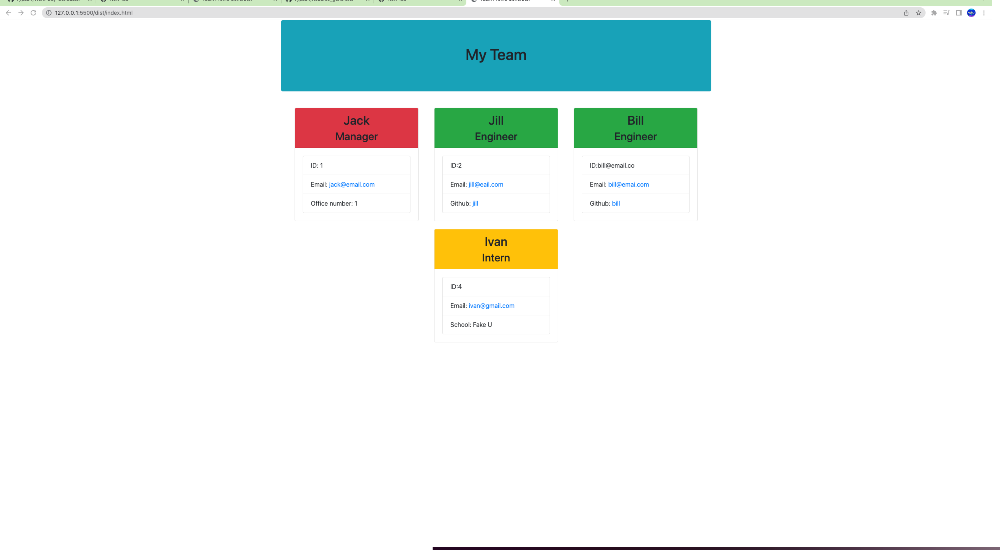

# Team-Profile-Generator


***
## Description
As a manager this application will be able to display the team's basic info.


## Table of Contents
* [Links](#links)

* [Installation](#installation)

* [Usage](#usage)

* [License](#license)

* [Code](#code)

* [Tests](#tests)

* [Questions](#questions)

## Links
Video: https://drive.google.com/file/d/1YS-AajgggjrA4TudvNyFfAlxRrfdhtWh/view?usp=share_link
Github: https://github.com/rypab4/Team-Profile-Generator

## Installations 

To install necessary dependencies, run the following command:

```
node.js
npm
inquirer
```


## Usage
This tool is to allow managers to enter their information and the people in their team (engineers and interns).  
1.  In integrative terminal mode enter node index.js.

2.  The following prompts will appear individually as you answer:


3.  Then in dist folder a index.html will appear and will show the following when opening in the browser:




## License
    
    This project is licensed under the MIT license


## Code
* HTML/CSS
* JS
* Bootstrap
* Node.js
* Jest
* Inquirer
* fs


## Tests
To run tests, run the follwoing command:
```
npm test
```

## Questions
If you have any questions about the repo, open an issue or contact me directly at rypab4@gmail.com.  You can find my work at https://www.github.com/rypab4.